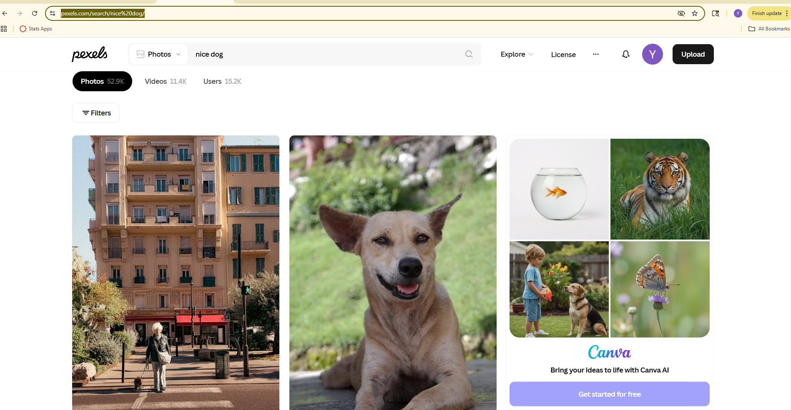
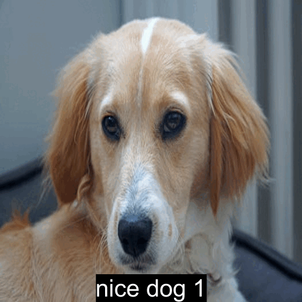

```{r setup, include=FALSE}
knitr::opts_chunk$set(echo=TRUE, message=FALSE, warning=FALSE, error=FALSE)
library(tidyverse)
selected_photos <- read_csv("selected_photos.csv")
```

```{css echo=FALSE}

```

## Introduction

For this project, I searched for photos on Pexels using the two words **nice dog**. I chose these words because dogs are popular pets, and I expected this search to return many different photos with different sizes, orientations, and photographers. The search URL I used was [https://www.pexels.com/search/nice%20dog/](https://www.pexels.com/search/nice%20dog/).



Before exploring the data from the Pexels API, I noticed three features about the photos returned by my search. First, the photos vary in size and orientation. Some are portrait while others are landscape. Second, many of the photos appear to be landscape, suggesting that wide images are more common. Third, the photos are taken by different photographers, with names of varying lengths.

The table below shows the URLs of the photos in my selected photos data frame.

```{r}
selected_photos %>%
  select(url) %>%
  knitr::kable()
```

## Key features of my selected photos

```{r}
# My personal purpose: calculate summary values for my selected nice dog photos.

mean_width <- selected_photos$width %>%
  mean(na.rm = TRUE)

median_height <- selected_photos$height %>%
  median(na.rm = TRUE)

number_landscape <- (selected_photos$orientation == "landscape") %>%
  sum(na.rm = TRUE)

# My personal purpose: compare photo size across different orientation groups.
grouped_photos <- selected_photos %>%
  group_by(orientation) %>%
  summarise(
    mean_width = mean(width, na.rm = TRUE),
    mean_height = mean(height, na.rm = TRUE)
  )

# My personal purpose: save one summary value from the grouped data frame.
mean_width_landscape <- grouped_photos$mean_width[
  grouped_photos$orientation == "landscape"
]
```

The mean width of my selected photos is `r round(mean_width, 1)` pixels.

The median height of my selected photos is `r round(median_height, 1)` pixels.

There are `r number_landscape` landscape photos in my selected photos.

The mean width of the landscape photos is `r round(mean_width_landscape, 1)` pixels.

## Creativity



My project demonstrates creativity because I used photo data from the Pexels API to create an animated GIF instead of only writing a static report. I used the `medium` photo URL variable from my selected photos data frame and used skills from earlier modules to read, resize, annotate, combine, animate, and save images. The GIF includes text on each photo, so it is not only a collection of images but a simple visual presentation of my selected dog photos. This connects data collection, data manipulation, and image creation together in one project.

## Learning reflection

One important idea I learned from Module 3 is how to create new variables from existing data. For example, I used the width and height variables to create an aspect ratio variable, and then used that to create an orientation variable. This helped me understand how raw data can be changed into more useful information for analysis. I also learned how to use filtering to select a smaller group of photos from a larger data frame.

I am more curious about how APIs can be used to collect different kinds of data from websites. I would like to explore how image data, text data, and other web data can be combined in one project. I am also interested in learning more about how computers can analyse image features such as size, colour, and layout.

## Appendix

```{r file='exploration.R', eval=FALSE, echo=TRUE}

```

```{r file='project3_report.Rmd', eval=FALSE, echo=TRUE}

```
