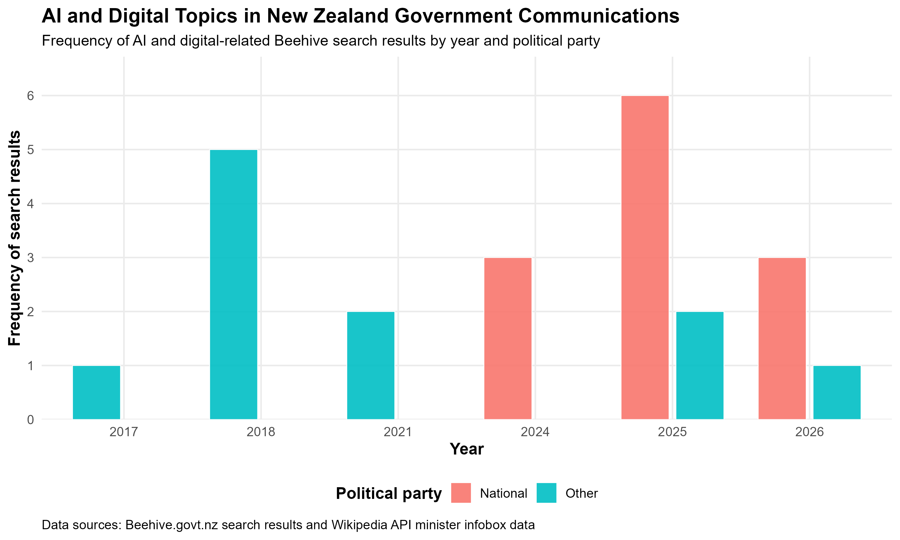

```{r setup, include=FALSE}
knitr::opts_chunk$set(
  echo = FALSE,
  warning = FALSE,
  message = FALSE,
  error = FALSE
)
```

## Introduction

For this project, I focused on AI and digital-related communications from the New Zealand Government Beehive website. I used search terms related to “AI” and “digital” and collected more than 60 search results from multiple pages of Beehive releases and speeches. I selected this topic because I am interested in data technologies, artificial intelligence, and how governments are responding to digital transformation in areas such as health, education, and innovation.

To create my dataset, I manually saved HTML pages from the Beehive website and used ethical web scraping techniques taught in STATS 220. I also used the Wikipedia API to collect minister-related information, such as political party data. When using Beehive data, it is important to acknowledge the source, avoid excessive requests to the website, and not misuse official government material or third-party content. The main data sources used in this project were https://www.beehive.govt.nz and the Wikipedia API.

## Visualisation

The purpose of my visualisation was to explore how frequently AI and digital-related topics appeared in New Zealand government communications and how these results were associated with different political parties over time.

I used text analysis with {stringr} and {dplyr} to identify AI and digital-related keywords from Beehive titles and summaries. I then combined this information with minister data collected from Wikipedia using a left join. The visualisation showed that most AI and digital-related communications in my dataset were associated with National ministers, especially in 2025 and 2026. Smaller parties and other ministers appeared occasionally, while Labour-related results were not strongly represented in the search results I collected.

The visualisation showed a strong increase in AI and digital-related government communications during 2025 and 2026, with most results associated with National ministers. Smaller parties and other ministers appeared occasionally in the dataset. One particularly interesting finding was that Labour-related ministers were not represented in the AI and digital-related Beehive search results I collected across the 2017–2026 period. While this does not necessarily mean that Labour governments did not discuss technology issues, it suggests that AI and digital transformation became much more visible and strongly communicated in recent Beehive releases under the current government.



## Creativity

My visualisation demonstrates creativity because it combines multiple digital data sources, text analysis, and data visualisation techniques into one purpose-driven project. I combined Beehive search results with Wikipedia API data and used stringr functions to classify AI and digital-related content. Instead of only showing raw search results, I created a visualisation that explored political and technological trends in government communication. The project also connects to my personal interest in AI and data technologies, which helped guide the topic selection and analysis.

## Learning reflection

One important idea I learned from Module 5 is that creating data from digital sources requires careful planning, ethical consideration, and understanding of how websites and APIs work. Before this project, I mostly thought of websites as places to read information. Through this project, I learned how HTML structure, CSS selectors, APIs, and data cleaning techniques can be used to turn web information into analysable datasets.

I also learned that digital data is often messy and inconsistent. For example, party names from Wikipedia were written in different ways, so I needed to standardise and clean the data before analysing it. Another challenge was ensuring that the correct HTML elements were selected during web scraping. This project made me more interested in learning about automated data pipelines, large-scale web scraping, and how AI systems process online text data.

## Self review

Across the five STATS 220 projects, I believe I developed stronger skills in both data manipulation and communicating with data technologies, which are important learning outcomes of the course. One important skill I developed was the ability to source and combine data from multiple digital sources. Throughout the projects, I learned how to work with CSV files, JSON data, APIs, HTML pages, and web scraping techniques. In Project 5, I combined Beehive search results with Wikipedia API data using joins and data wrangling techniques.

A second important skill I developed was creating purpose-driven visualisations using ggplot2 and tidyverse tools. Earlier in the course, I focused mainly on getting plots to work correctly. By completing the projects, I became more aware of how data visualisations should communicate meaningful patterns clearly and effectively. I also became more confident using dplyr, stringr, joins, grouping, summarising, and text analysis to support data storytelling and communication.

## Appendix

```{r file='scrape_html.R', eval=FALSE, echo=TRUE}

```
```{r file='data_sources.R', eval=FALSE, echo=TRUE}

```
```{r file='visualisation.R', eval=FALSE, echo=TRUE}

```