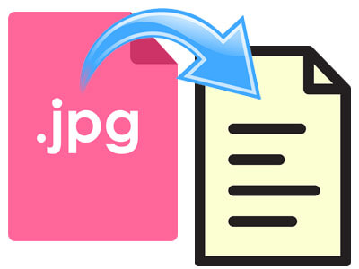

# stats220

This is my repo for STATS 220. 

## A little about me:

- I am undertaking a degree in  Computer Science and Statistics at the University of Auckland.
- I am taking STATS 220 because I want to develop my skills in data science, programming, and modern data technologies.
- I am interested in learning about  machine learning, AI, web data, and real-world data applications.

## A meme that captures how I currently feel about my university studies is 

# Assignment 1

# Part A
## head level test

level 1:
# head
level 2:
## head

## two different types of bullet points (ordered and unordered)
* unordered list can use -, *, or +.
- unorder item 1
- unorder item 2
- unorder item 3
      
* ordered list
1. First item
2. Second item
3. Third item
## bold, italics, inline code test
**bold**  
*italics*  
Use the `sum()` function in R to calculate the total.

## link test
### web link
[Tom & jerry](https://www.youtube.com/watch?v=rYFgSBug-sk&t=26s)
### picture link

### gif link

# Part B
## Inspo meme

Link to meme:
https://www.easetext.com/assets/img/tutorial/jpg-to-text.jpg

### Meme image

### Meme design analysis

My meme uses a two-part layout. The left side shows the original JPG image,
while the right side shows the target output format after conversion.

The design creates a clear visual comparison between the starting format and
the converted result.

### Key components of the meme design include:
- A two-panel layout with a left side and a right side
- An original JPG image shown on the left
- A converted target format shown on the right
- Text labels that explain the input and output formats
